# Laboratorium 12

Autor: Mateusz Machowski <br>
Grupa: 4 <br>
Kierunek: Informatyka Stosowana - Stacjonarnie <br>
Przedmiot: Nowoczesne Technologie Przetwarzania Danych <br>  
Temat: Business Intelligence - wizualizacja i analiza danych w narzędziu Metabase <br>
Data wykonania: 11.06.2026 <br>
Data oddania: 18.06.2026 <br>
## 1. Cel ćwiczenia

Celem ćwiczenia jest praktyczne poznanie procesu Business Intelligence (BI); załadowanie wcześniej przetworzonych danych do bazy analitycznej; podłączenie narzędzia BI (Metabase) do bazy danych; tworzenie zapytań, wykresów i interaktywnego dashboardu; definiowanie wskaźników (KPI) oraz przygotowanie wyników w formie raportu. Laboratorium pokazuje, jak dane przetworzone we wcześniejszych ćwiczeniach (np. w Apache Spark) zamienić w czytelną informację dla odbiorcy biznesowego.
## 2. Środowisko

Do wykonania ćwiczenia wykorzystałem:

- Docker Desktop,
- Docker Compose,
- PostgreSQL jako bazę analityczną,
- Metabase jako narzędzie BI,
- Python do wygenerowania i załadowania danych.

Środowisko uruchomiłem poleceniem:

```bash
docker compose up -d
```

Następnie sprawdziłem, czy kontenery zostały poprawnie uruchomione:

```bash
docker compose ps
```

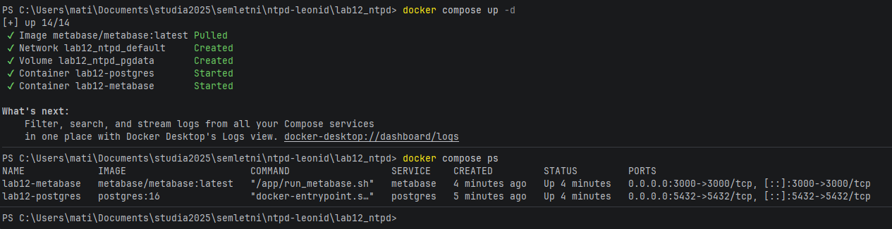

Wersje użytych obrazów sprawdziłem poleceniem:

```bash
docker compose images
```

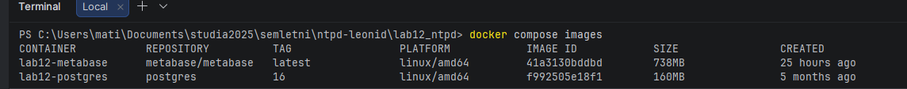

Po uruchomieniu kontenerów otworzyłem Metabase w przeglądarce pod adresem:

```text
http://localhost:3000
```

Następnie utworzyłem konto administratora w Metabase.

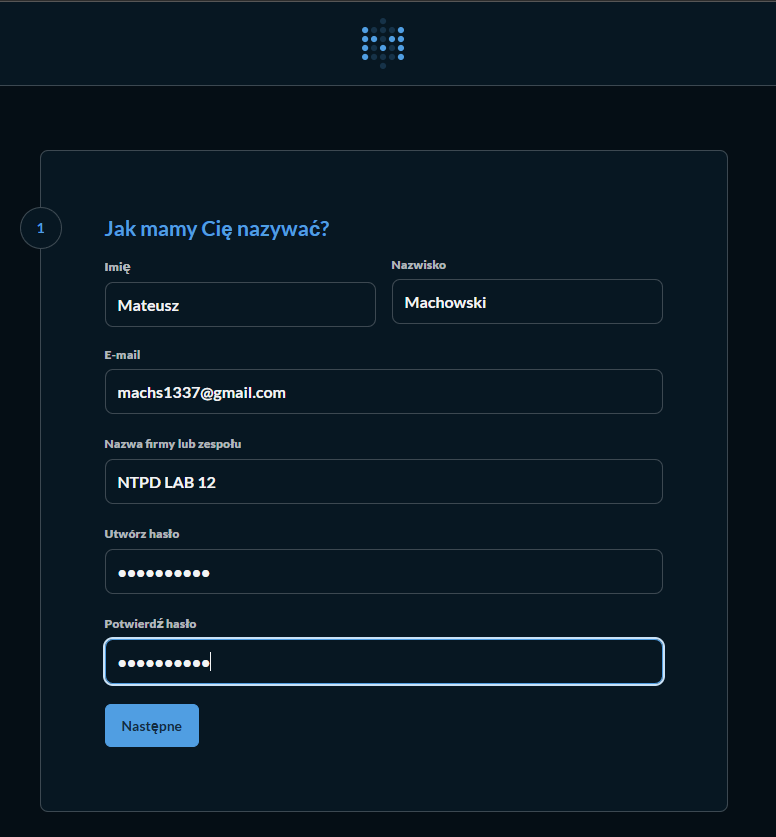

## 3. Przygotowanie i załadowanie danych

Dane wejściowe zapisałem w pliku `data/transactions.csv`. Zbiór zawierał przykładowe transakcje z następującymi polami:

- `transaction_id`,
- `event_time`,
- `user_id`,
- `category`,
- `amount`,
- `status`.

Dane wygenerowałem poleceniem:

```bash
python scripts/generate_transactions.py
```

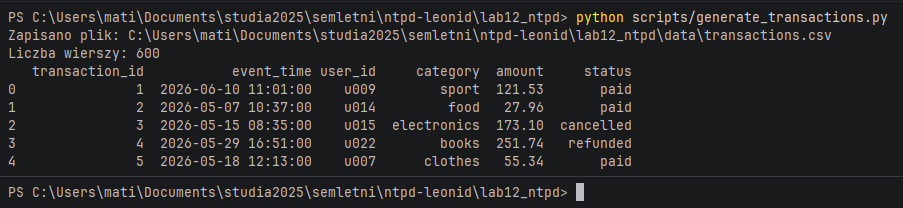

Następnie załadowałem dane do PostgreSQL poleceniem:

```bash
python scripts/load_data.py
```


W skrypcie Python połączenie z bazą PostgreSQL skonfigurowałem przy użyciu biblioteki SQLAlchemy oraz sterownika `pg8000`. Ponieważ skrypt uruchamiałem lokalnie z poziomu systemu Windows, połączenie z bazą odbywało się przez port wystawiony przez Docker Compose:

```txt
127.0.0.1:5433
```

W Metabase połączenie z bazą skonfigurowałem osobno przez formularz dodawania bazy danych. Ponieważ Metabase działa w kontenerze Docker, jako host podałem nazwę usługi z pliku `docker-compose.yml`, czyli `postgres`, oraz port wewnętrzny kontenera:

```txt
5432
```

Dzięki temu skrypt Python łączył się z bazą przez port udostępniony na komputerze hosta, natomiast Metabase łączył się z PostgreSQL bezpośrednio przez sieć kontenerów Dockera.


Config połączenia bazy danych w metabase:

- typ bazy: PostgreSQL,
- host: `postgres`,
- port: `5432`,
- database name: `ntpd`,
- user: `bi`,
- password: `bi`.

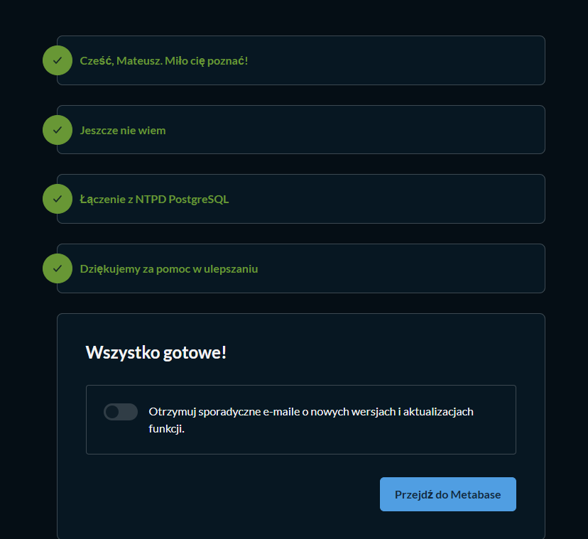

Po dodaniu połączenia sprawdziłem, czy tabela `transactions` jest widoczna w Metabase i czy można przejrzeć jej zawartość.

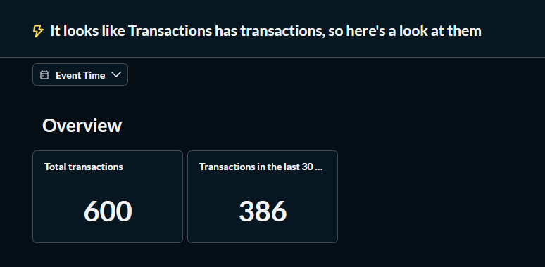


## 4. Pytania i wizualizacje w Metabase

### 4.1. Pytanie 1 - łączny przychód

Pierwsze pytanie przygotowałem w kreatorze wizualnym Metabase. Ograniczyłem dane do transakcji o statusie `paid`, a następnie obliczyłem sumę pola `amount`.

Wybrałem wizualizację typu `Number`, ponieważ pojedyncza wartość dobrze nadaje się do przedstawienia wskaźnika KPI.

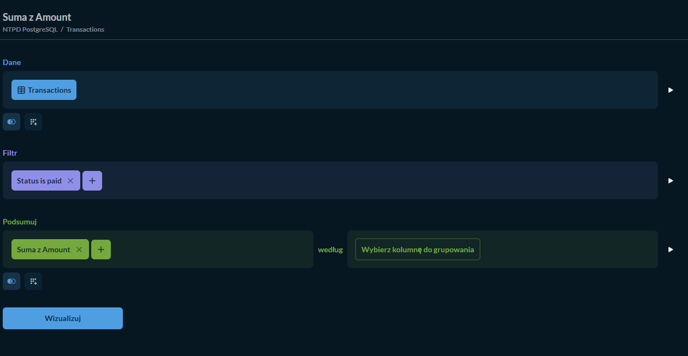
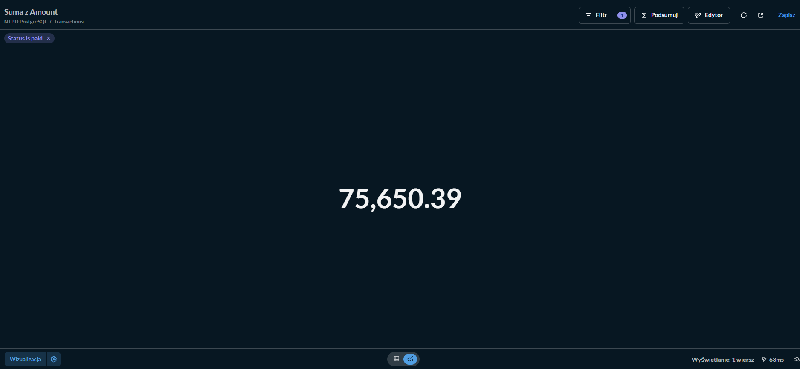
### 4.2. Pytanie 2 - przychód według kategorii

Drugie pytanie przygotowałem w celu pokazania sumy przychodu w podziale na kategorie produktów. Zastosowałem grupowanie po polu `category` oraz agregację `SUM(amount)`.

Wybrałem wykres słupkowy, ponieważ ułatwia porównanie kategorii między sobą i szybko pokazuje, które kategorie wygenerowały największy przychód.

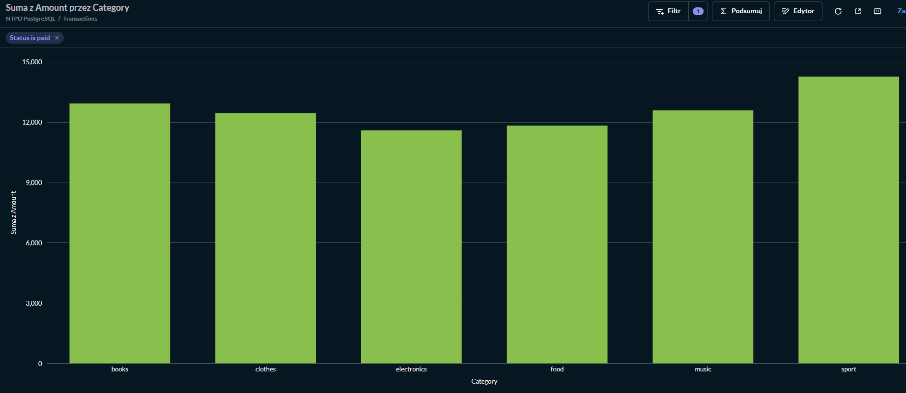

### 4.3. Pytanie 3 - udział statusów transakcji

Trzecie pytanie przygotowałem jako zapytanie SQL:

```sql
SELECT status,
       COUNT(*) AS transactions,
       ROUND(100.0 * COUNT(*) / SUM(COUNT(*)) OVER (), 2) AS share_percent
FROM transactions
GROUP BY status
ORDER BY transactions DESC;
```

Wybrałem tabelę, ponieważ pytanie dotyczy udziału poszczególnych statusów w całości danych. Taka wizualizacja pozwala szybko sprawdzić, jaka część transakcji została opłacona, anulowana lub oczekuje na płatność.

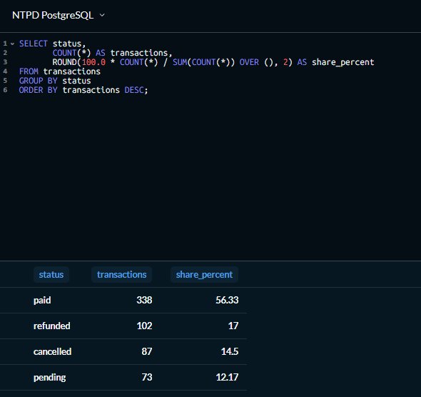

### 4.4. Pytanie 4 - trend sprzedaży w czasie

Czwarte pytanie przygotowałem, aby sprawdzić zmianę przychodu w czasie. Transakcje pogrupowałem według dnia, a dla każdego dnia policzyłem sumę wartości opłaconych transakcji.

Wybrałem wykres liniowy, ponieważ najlepiej pokazuje trend i zmiany wartości w czasie.

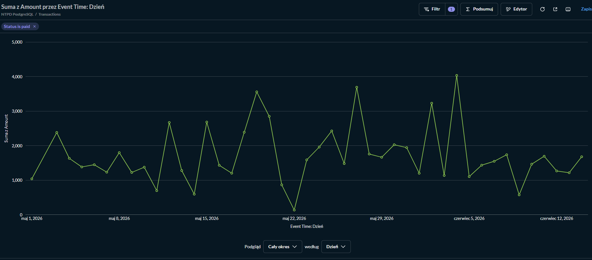

## 5. Dashboard

Utworzyłem dashboard `LAB12 BI Dashboard`, na którym umieściłem przygotowane wcześniej karty:

- łączny przychód,
- przychód według kategorii,
- trend sprzedaży w czasie,
- udział statusów transakcji.


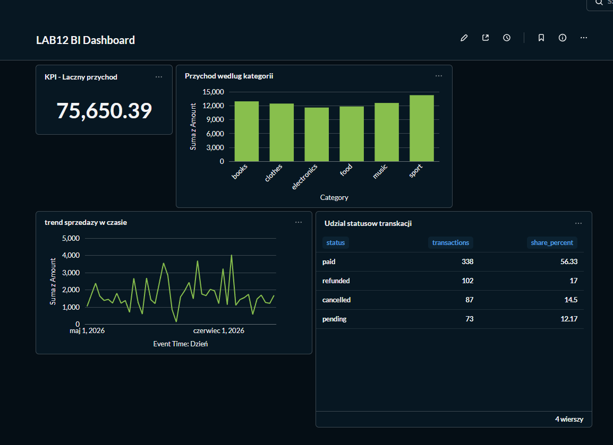

Na dashboardzie dodałem filtr `Kategoria`, który pozwala ograniczać dane do wybranej kategorii transakcji, np. `sport`, `books` lub `music`. Filtr połączyłem z kartami opartymi na tabeli `transactions`, przypisując go do kolumny `category`. Po zmianie wartości filtra dashboard automatycznie aktualizował wartości i wykresy, dzięki czemu można było analizować dane tylko dla wybranej kategorii.

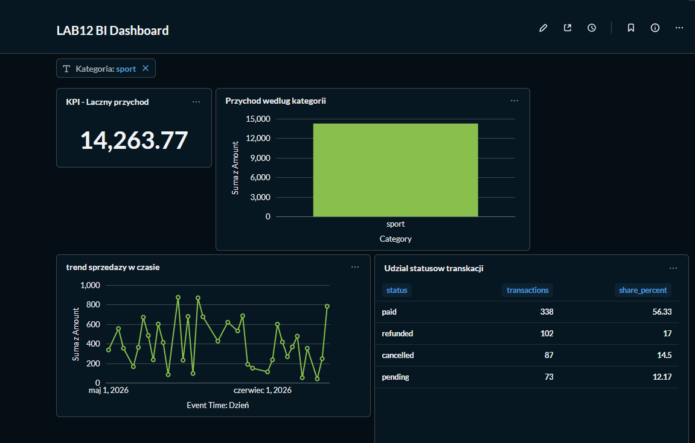

## 6. Wskaźniki KPI

W ćwiczeniu zdefiniowałem dwa główne wskaźniki KPI. Pierwszym z nich był łączny przychód, czyli suma wartości transakcji o statusie paid. Wskaźnik ten został przedstawiony w Metabase jako karta typu Number, ponieważ pojedyncza wartość dobrze pokazuje najważniejszą informację biznesową.

Drugim wskaźnikiem był udział transakcji opłaconych, czyli procent transakcji ze statusem paid względem wszystkich transakcji. W przygotowanym zbiorze danych 338 z 600 transakcji miało status paid, co daje około 56,33%.

Dodatkowo na podstawie danych można wyliczyć średnią wartość opłaconej transakcji. Takie wskaźniki pomagają szybciej ocenić skuteczność sprzedaży i jakość wygenerowanych danych.
## 7. Analiza biznesowa

Z przygotowanych danych wynika, że największy przychód wygenerowała kategoria sport - 14 263,77. Kolejne kategorie to books - 12 930,78 oraz music - 12 584,59. Najniższy przychód wśród opłaconych transakcji miała kategoria electronics - 11 592,79.

Łączny przychód z transakcji opłaconych wyniósł 75 650,39. Spośród 600 transakcji 338 miało status paid, czyli 56,33% wszystkich rekordów. Oznacza to, że trochę ponad połowa wszystkich transakcji została zakończona płatnością, a pozostałe rekordy obejmowały transakcje anulowane, oczekujące lub zwrócone.
## 8. Udostępnianie wyników

Metabase umożliwia eksport wyników zapytań do pliku CSV. Dzięki temu dane z przygotowanych analiz można przekazać innym osobom lub wykorzystać w arkuszu kalkulacyjnym.

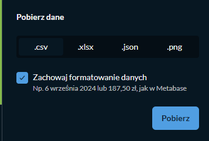

## 9. Różnice pojęciowe

Przetwarzanie danych polega na czyszczeniu, transformowaniu i przygotowaniu danych do dalszej analizy. Warstwa Business Intelligence służy już do prezentowania danych w formie pytań, wykresów, KPI i dashboardów.

Dashboard jest interaktywny i pozwala zmieniać filtry oraz szybko obserwować aktualne wskaźniki. Raport statyczny jest mniej elastyczny, ponieważ pokazuje wyniki przygotowane w konkretnym momencie.

Zapytanie ad-hoc jest jednorazowym pytaniem zadanym do danych, np. w celu szybkiego sprawdzenia konkretnej informacji. Zdefiniowany wskaźnik KPI jest stałą metryką biznesową, którą można obserwować regularnie i porównywać w czasie.

## 10. Porównanie Metabase z innym narzędziem BI

Metabase jest wygodny do szybkiego uruchomienia, prostych dashboardów i pracy bez pisania dużej ilości kodu SQL. Jest dobrym wyborem do laboratoriów, małych projektów i szybkiej analizy danych.

Apache Superset daje większe możliwości konfiguracji, bardziej rozbudowane dashboardy i lepiej sprawdza się w większych środowiskach analitycznych. Wymaga jednak więcej konfiguracji niż Metabase.

Power BI jest bardzo wygodny w środowisku biznesowym, szczególnie gdy dane pochodzą z Excela, Microsoft 365 lub usług Microsoftu. Jest jednak bardziej związany z ekosystemem Microsoftu.

W ćwiczeniu wykorzystałem Metabase zgodnie z wymaganiami instrukcji. Narzędzie dobrze sprawdziło się w tym zadaniu, ponieważ pozwoliło szybko połączyć się z bazą PostgreSQL, utworzyć pytania analityczne oraz przygotować dashboard bez rozbudowanej konfiguracji.
## 11. Wnioski

Laboratorium pokazało mi pełny prosty proces BI: przygotowanie danych, załadowanie ich do bazy analitycznej, podłączenie narzędzia BI oraz przygotowanie pytań i dashboardu. Metabase okazał się prostym narzędziem do szybkiej wizualizacji danych i tworzenia podstawowych analiz biznesowych.
